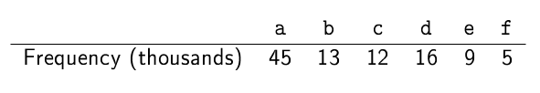
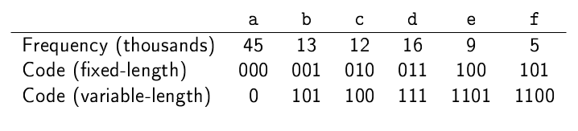
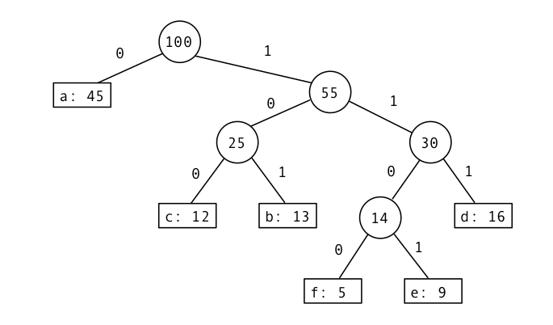

# Huffman coding

Huffman coding is a
very elegant and simple but powerful compression algorithm. It generates a binary sequence that represents each character
required. This might be the English alphabet, some subset of that, or
any collection of symbols.

Say we have a 100KB file made up of repetitions of the letters 'a' to 'f'.
We start by creating a frequency table:

If we use a fixed-length code we can encode this data in about
37.5KB. If we use a variable-length code and assign the shortest code
to the most frequently used characters, we can encode it in just
28KB. (Note that in the table below the code for each character is
made up of the *bits* 1 and 0, not made the *characters*, each of
which occupies at least 8 bits depending on the encoding.)

It should be clear that in order to decode a stream of variable-length
codes, no code should be a prefix of any other.  We can create the
variable-length codes using a binary tree (not a search tree) called a
*Huffman tree*. In a Huffman tree the leaves contain the data, which
is a character and its frequency. Internal nodes are labelled with the
combined frequencies of their children.

To decode data we go start at the root and go left for 0, and right
for 1 until we get to a leaf. So, to decode `0101100`, we start at the
root and after consuming a single digit from the code, `0`, we reach a
leaf labelled `a`. We return to the root and take digits from the code
until we reach another leaf, which is labelled `b`, and so on,
eventually decoding the whole string `abc`.

The most elegant part of this scheme is the algorithm used to create the tree:

1. Uses the frequency table to make a leaf node object for each character, including a label
for its frequency.
2. Puts these nodes in a *priority queue*, where the lowest
frequency has highest priority.
3. Repeatedly:
    - Removes two nodes from the queue and insert them as children
to a new branch node. The new node is labelled by the sum of the frequency labels of its children.
    - Puts the new node back in the queue.
    - When there is only one item in the queue, that's the Huffman
tree.

The code in the package `huffman.tree`, represents a binary 
Huffman tree made up of *branch* nodes and *leaf* nodes. Because it is a Huffman tree,
each branch node is labelled with an `int`, whereas leaf nodes have two labels, an 
`int` and a `char`. The `Node` class is an abstract class which is the *superclass* 
of the classes `Branch` and `Leaf`. `Node` contains the implementation of several 
methods that are common to any subclass (`getFreq`, `setFreq` and `toString`) and 
one that will be implemented differently in branches and leaves: `traverse`.
